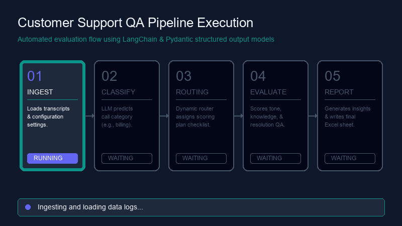

# GenAI Customer Support QA Pipeline

An enterprise-ready, modular, and config-driven Quality Assurance (QA) pipeline that automates the auditing of customer support call transcripts. Built using **LangChain Expression Language (LCEL)**, **Pydantic** structured schemas, and **Python-pptx**, this project enables 100% QA coverage at a fraction of manual auditing costs.

---

## 📽️ Execution Flow

The animation below illustrates the step-by-step pipeline execution, highlighting active stages and status checks:



---

## ✨ Key Features

1. **Modular Architecture:** Clean division of responsibilities across classification, routing, criteria evaluations, and executive summarizing.
2. **Pydantic Validation:** Strict JSON schema validation for LLM outputs, eliminating fragile regular expression extraction.
3. **Dynamic Router Pattern:** Automatically determines custom evaluation criteria checklists based on the classified call type (e.g. evaluating tone/empathy for complaints, and factual accuracy for billing or claims inquiries), reducing API token spend by up to 50%.
4. **Multi-LLM Agility:** Decoupled config loader supporting seamless switches between **OpenAI (GPT-4o-mini)** and **Google Gemini (Gemini 1.5 Flash)**.
5. **Robust File-Lock Handling:** Protection against Windows Excel file locks during batch processing reads/writes.
6. **Built-in Presentation & Assets:** Programmatically generated widescreen presentations and animated workflow diagrams.

---

## 📁 Directory Structure

```text
├── config/
│   └── config.json           # Active prompts, labels, criteria, and LLM temperature configurations
├── data/
│   ├── transcripts.csv       # Input transcripts database (CSV)
│   ├── transcripts.xlsx      # Input transcripts database (Excel)
│   └── output.xlsx           # Detailed pipeline outputs (categories, scores, summaries, training tips)
├── logs/
│   └── app.log               # Pipeline logs
├── src/
│   ├── __init__.py
│   ├── components/
│   │   ├── __init__.py
│   │   ├── classification.py # Call category classification chain (Pydantic schema check)
│   │   ├── evaluation.py     # Independent evaluators (Tone/Empathy, Knowledge, Resolution)
│   │   ├── router.py         # Dynamic routing logic mapping call types to evaluation plans
│   │   └── reporting.py      # Distills scores into manager summaries & agent training feedback
│   ├── pipeline/
│   │   ├── __init__.py
│   │   └── pipeline.py       # Orchestrates batches and merges execution outputs
│   └── utils/
│       ├── __init__.py
│       ├── config_loader.py  # Standardized loader for json configurations and environment vars
│       ├── data_loader.py    # Loads transcripts securely
│       ├── helpers.py        # Output dataframe savers
│       └── llm_loader.py     # Config-based chat LLM initialization
├── main.py                   # Root runner orchestrating the entire system
├── requirements.txt          # Python dependencies
└── template.py               # Utility script creating directory scaffolding
```

---

## ⚙️ Configuration & Setup

### 1. Prerequisites
Ensure you have Python 3.10+ installed.

### 2. Install Dependencies
Set up your virtual environment and install the required libraries:
```bash
# Create a virtual environment
python -m venv adityaenv

# Activate it (Windows)
adityaenv\Scripts\activate

# Install dependencies
pip install -r requirements.txt
```

### 3. Environment Variables
Create a `.env` file in the root directory:
```env
LLM_PROVIDER=openai  # Options: openai | gemini
OPENAI_API_KEY=your-openai-api-key-here
GOOGLE_API_KEY=your-google-api-key-here
```

### 4. System Settings (`config/config.json`)
Configure your parameters, temperature, evaluation metrics, and categories dynamically:
```json
{
  "LLM_PROVIDER": "openai",
  "llm": {
    "openai_model": "gpt-4o-mini",
    "gemini_model": "gemini-1.5-flash",
    "temperature": 0.3
  },
  "evaluation": {
    "criteria": ["tone_empathy", "knowledge_accuracy", "resolution_quality"],
    "score_range": [1, 5]
  },
  "classification": {
    "labels": ["billing", "claims", "complaint", "general_query"]
  }
}
```

---

## 🚀 Execution & Usage

To execute the entire batch pipeline and audit transcripts, run the following command:
```bash
python main.py
```

Upon successful completion, check `data/output.xlsx`. The output spreadsheet contains:
- `predicted_call_type`: Auto-classified call categories.
- `confidence`: Classifier confidence scores.
- `evaluation_plan`: The dynamically assigned scoring plan.
- `evaluation_output`: Raw evaluation ratings and reasoning.
- `summary`: Written manager performance reports.
- `recommendations`: Actionable coaching steps generated for the support agent.

---

## 📊 Promotional Assets

We have compiled visual resources to share this project on LinkedIn or with stakeholders:
1. **PowerPoint Presentation:** Located at `Customer_Service_QA_Pipeline.pptx`. Widescreen slide deck breaking down the architecture, routing patterns, and operational value.
2. **Animated Execution Flow:** Located at `pipeline_execution.gif`. Displays the step-by-step pipeline execution, perfect for a repository showcase.
